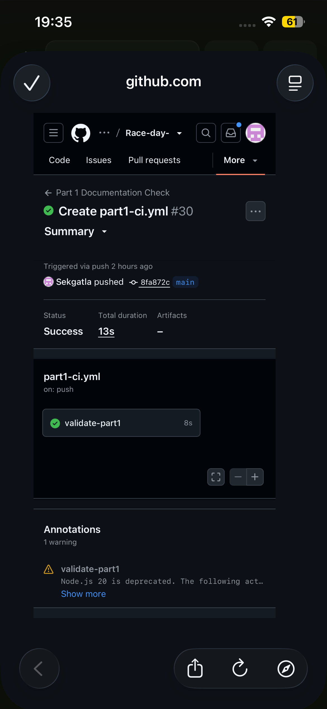

<div align="center">

<pre>
  ____                 ____             
 |  _ \ __ _  ___ ___ |  _ \  __ _ _   _
 | |_) / _` |/ __/ _ \| | | |/ _` | | | |
 |  _ < (_| | (_| (_) | |_| | (_| | |_| |
 |_| \_\__,_|\___\___/|____/ \__,_|\__, |
                                    |___/ 
</pre>

**Event management and race results platform**

Part 1 · System planning and database design

[](https://github.com/Sekgatla/Race-day-/actions/workflows/part1-ci.yml) [](docs/RaceDay_Database.sql) [](docs/)

</div>

---

## Table of Contents

- [Overview](#overview)
- [User roles](#user-roles)
- [Part 1 evidence](#part-1-evidence)
- [Data model](#data-model)
- [Database setup](#database-setup)
- [API plan](#api-plan)
- [CI evidence](#ci-evidence)
- [Video presentation](#video-presentation)
- [Repository layout](#repository-layout)
- [Roadmap](#roadmap)

## Overview

RaceDay is designed to replace paper registrations, separate spreadsheets and manual result tracking with one organised system for South African running, walking and cycling events.

> **Part 1 focus:** plan the data model, document the future REST API, create the SQL Server database script and validate the repository with GitHub Actions.

The API and MVC application will be developed in Parts 2 and 3.

## User roles

| Role | Responsibilities |
|:---|:---|
| **Organiser** | Manage events and categories, view enrolments, capture results, and maintain route and weather information. |
| **Participant** | Create an account, browse events, choose a category, enrol, and view personal results. |

Role-based access will be enforced by the API in Part 2 and reflected in the MVC interface in Part 3.

## Part 1 evidence

| Document | Purpose |
|:---|:---|
| [RaceDay ERD](docs/RaceDay_ERD.pdf) | Seven-entity relational design with attributes, keys, relationships and cardinality. |
| [Editable ERD source](docs/RaceDay_ERD.dot) | Graphviz source for the ERD. |
| [API endpoint plan](docs/RaceDay_API_Endpoint_Plan.md) | HTTP methods, routes, roles, request bodies and responses. |
| [SQL database script](docs/RaceDay_Database.sql) | SQL Server schema, constraints, seed data and verification queries. |

## Data model

The database contains seven entities:

- **Users** — organiser and participant accounts
- **Events** — RaceDay events managed by organisers
- **Categories** — event divisions and entry options
- **Enrolments** — participant entries and selected categories
- **Results** — finish positions, times and result status
- **Routes** — route information for events
- **EventWeather** — event weather forecasts and advisories

Enrolments resolves the many-to-many relationship between participants and events. Results are separated from enrolments because a participant may enrol before completing an event.

## Database setup

Run `docs/RaceDay_Database.sql` in SQL Server Management Studio (SSMS) on a clean SQL Server instance:

1. Execute the complete script from top to bottom.
2. Confirm that the `RaceDayDb` database and seven tables are created.
3. Review the verification queries at the end of the script.
4. Confirm the organiser, participant, event, category, enrolment, route, weather and result sample data.

The script defines primary keys, foreign keys, `NOT NULL`, `UNIQUE`, `DEFAULT` and `CHECK` constraints.

## API plan

The planned REST API covers authentication, user profiles, events, categories, enrolments and results, with additional route and weather endpoints. Each endpoint documents its HTTP method, route, description, required role, request body and expected response.

## CI evidence

The workflow in [.github/workflows/part1-ci.yml](.github/workflows/part1-ci.yml) checks that the `docs` folder and the required ERD, API plan, SQL script and README are present and non-empty.

<p align="center">
  
</p>

## Video presentation

The presentation uses my own voiceover and explains the repository, ERD decisions, API plan, SQL design, live SSMS execution, seeded data and the successful CI build.

> **Unlisted YouTube link:** _Add the final unlisted video URL here before submission._

## Repository layout

```text
Race-day-/
├── README.md
├── docs/
│   ├── RaceDay_ERD.pdf
│   ├── RaceDay_ERD.dot
│   ├── RaceDay_API_Endpoint_Plan.md
│   ├── RaceDay_Database.sql
│   └── ci-green-build.png
└── .github/workflows/part1-ci.yml
